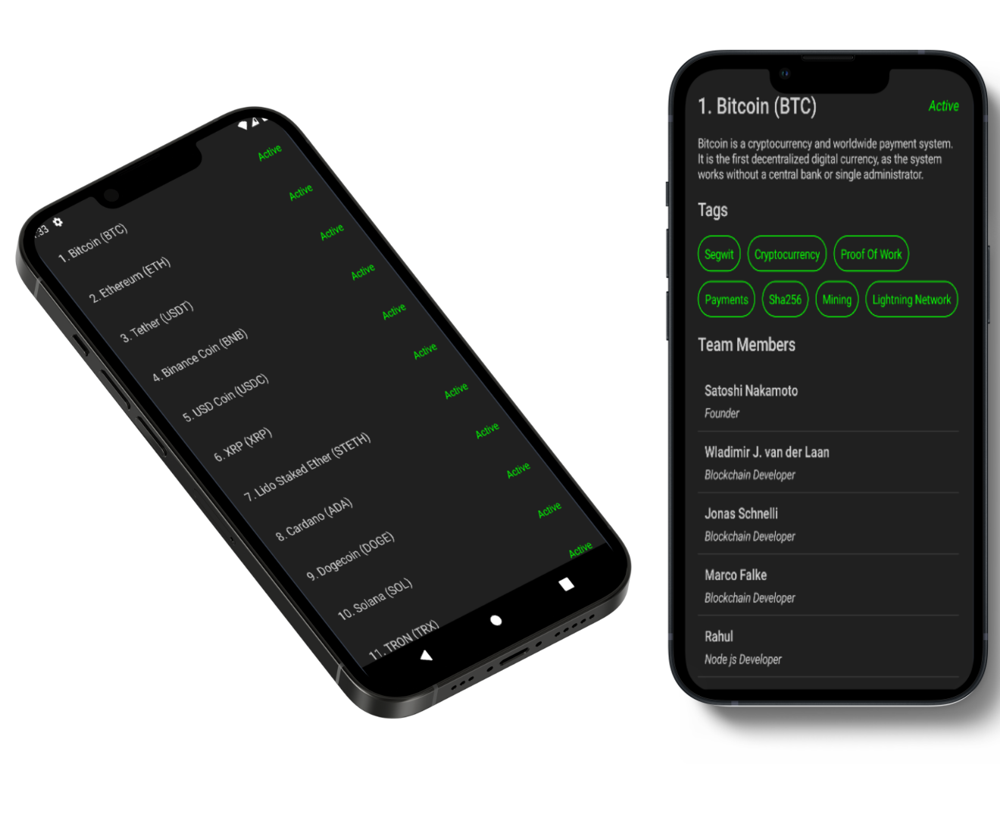

# Cryptocurrency App
CryptocurrencyApp is a cutting-edge Android cryptocurrency application crafted with Jetpack Compose, Clean Architecture, and integration with the CoinPaprika API. It delivers a comprehensive solution for users to explore, understand, and track cryptocurrencies in real-time.

## App Preview

## Features:
- Explore a vast world of cryptocurrencies with ease.
- Access vital information like rank, name, symbol, and activity status.
- Dive into detailed descriptions, tags, team members for each crypto.
- Get acquainted with the talented teams behind the projects.

## Acknowledge

In This App i used:
- Jetpack Compose for the design
- Clean Architecture
- Api integration with coinpaprika Api
- Retrofit for dealing with Api and make http requests
- Use Cases

## Contributing

1. Fork it (<https://github.com/tokhy1/CryptocurrencyApp.git/fork>)
2. Create your feature branch (`git checkout -b feature/fooBar`)
3. Commit your changes (`git commit -am 'Add some fooBar'`)
4. Push to the branch (`git push origin feature/fooBar`)
5. Create a new Pull Request

## Contact 
- Email: <mohamed21346587@gmail.com>
- LinkedIn: [LinkedIn Profile](https://www.linkedin.com/in/mohamed-ashraf-abd-elmoneam-409538246?lipi=urn%3Ali%3Apage%3Ad_flagship3_profile_view_base_contact_details%3BgLq%2BPh0QQX62Mwzt3ozQGQ%3D%3D)

Happy Coding!
